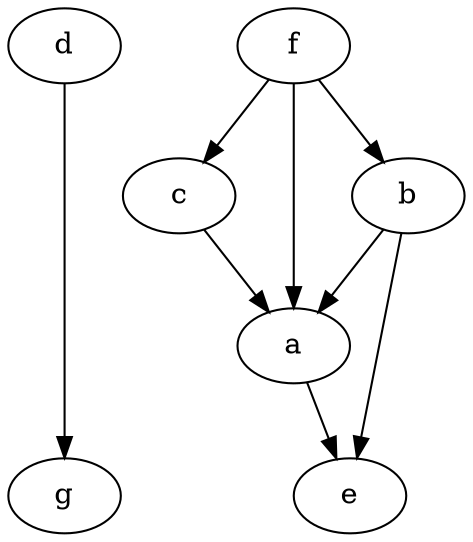

This week I spent some time working on a CS problem that required me to perform topological search of a graph.
<!-- more -->
The problem didn't seem so complicated at first glance:

> Design a program which takes as input an array of tasks and an array containing pairs of dependency relationships. Each dependency relationship consists of a pair of tasks wherein the first task must be completed before the second task is completed. Your progam must must return an array consisting of a valid order in which each of the tasks may be completed or return an error if no valid order is possible.

Solving this problem, however, isn't quite so straightforward as many of the string and array manipulation questions I typically get confronted with in the on a day to day basis. The question really requires diving into the topic of Topological sorting of graphs. This question really excited me so I decided to sit down, put in the time, and work my way through a solution.
What captured my attention about this problem is that its application is immediatly clear: this is dependency resolution. In other words, the problem solved by this excercise is the same fundamental problem that many of the tools I rely on every single day address such as Bundler to install Ruby gem dependencies, Apt to manage package dependencies on my Debian GNU/Linux laptop, and Systemd to manage process initialization on my servers.

Although the inputs in this excercise are Arrays, they are ultimately describing the edges of a directed graph, *i.e.* a graph in which nodes have a one-way or directional relationship to adjacent nodes. In this case the directionaly is the `dependency -> dependant` relationship between some of the task nodes.

According to [Wikipedia](https://en.wikipedia.org/wiki/Topological_sorting), topoligcal sorting of a directed graph can be described as

>a linear ordering of its vertices such that for every directed edge *uv* from vertex *u* to vertex *v*, *u* comes before *v* in the ordering. For instance, the vertices of the graph may represent tasks to be performed, and the edges may represent constraints that one task must be performed before another; in this application, a topological ordering is just a valid sequence for the tasks. A topological ordering is possible if and only if the graph has no directed cycles, that is, if it is a directed acyclic graph (DAG). Any DAG has at least one topological ordering, and algorithms are known for constructing a topological ordering of any DAG in linear time.

Simple right? So how do we actually implement topological sorting and solve the problem at hand? Let's consider a sample data set.

Lets say that we are given a list of projects and their respective dependency relationships in the following form:

```ruby
tasks = ["a", "b", "c", "d", "e", "f", "g"]

dependencies = [["b", "e"], ["a", "e"], ["f", "b"],
                ["f", "c"], ["c", "a"], ["f", "a"],
                ["b", "a"], ["d", "g"]]
```

As a first step, let's see if we can interpret this data to more naturally visualize it as a graph. The each element in the dependencies array represents a directional connection from, for example, task `b` to task `e`. While we want to capture this representation programattically in Ruby let's start out by using the DOT graph description language to generate a graph diagram. The graph in this sample input can be described (with some tweaks for aesthetics and clarity) by the following DOT file:



Once compiled, the above file produces this chart:


From just a quick look at this image we can ascertain a few basic facts:

 1. This graph is disconnected and therefore there is not a path between each node and all other nodes.
 2. This graph contains no cycles and therefore should have at least one valid topological sorting order.
 3. This graph contains nodes with multiple distinct dependencies and therefore likely has multiple valid topological sorting orders because the order of dependencies is not strictly prescribed.

 Here is the first version of the code I came up with to solve this problem:

```ruby
# Main method, takes specified input arrays
# returns array of tasks in valid order
# unless error is raised
def build_order(tasks, dependencies)
  # Converts graph data to hash representation
  deps = create_deps(tasks, dependencies)
  build_stages = []

  while !deps.empty? do
    processing = add_no_dependants(deps)
    build_stages << processing

    processing.each do |t|
      if !deps[t][:dependants].empty?
        deps[t][:dependants].each do |d|
          deps[d][:dependencies] -= 1
        end
      end
      deps.delete(t)
    end
  end

  return build_stages.flatten
end

def create_deps(tasks, dependencies)
  deps = Hash.new

  tasks.each do |t|
    deps[t] = {dependencies: 0, dependants: []}
  end

  dependencies.each do |d|
      deps[d[0]][:dependants] << d[1]
      deps[d[1]][:dependencies] += 1
  end

  return deps
end

def add_no_dependants(deps)
  processing = []

  deps.keys.each do |t|
    if deps[t][:dependencies] == 0
      processing << t
    end
  end

  return processing if processing.length > 0

  raise "An error has occurred. No valid order detected."
end
```
